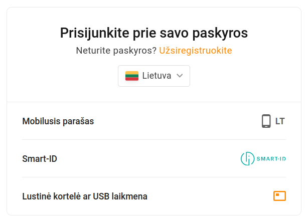
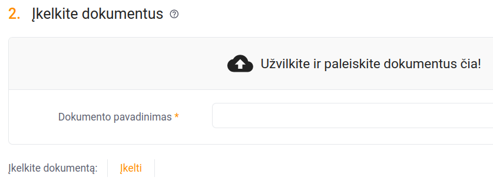
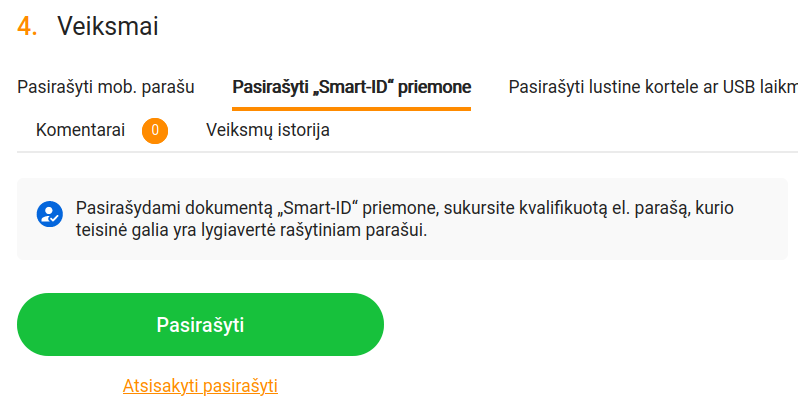
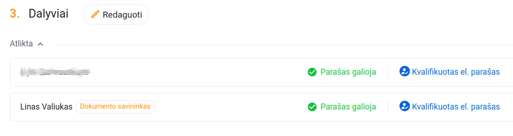
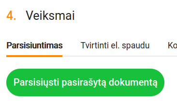

# Peticijos pasirašymo su "Dokobit" instrukcija

Turint "Smart-ID" paskyrą su kvalifikuotu elektroniniu parašu, itin paprasta dokumentus pasirašyti su "Dokobit".

1. Atsisiųskite failą [`covid-peticija.pdf`](covid-peticija.pdf) su mano parašu.
2. Perskaitykite peticijos tekstą, jeigu dar neperskaitėte.
3. Eikite į <https://www.dokobit.com/lt/>
4. Užsiregistruokite, jeigu anksčiau nesate to padaręs; registracijai naudokite "Smart-ID" paskyrą.
5. Prisijunkite prie "Dokobit" naudodami "Smart-ID" paskyrą:

    

6. Dešinėje viršuje spauskite "Įkelti dokumentą":

    

7. Užvilkite anksčiau atsisiųstą `covid-peticija.pdf` ant tam skirtos vietos arba paspauskite nuorodą "Įkelti", tuomet žemiau paspauskite mygtuką "Tęsti":

    

8. Nuvažiuokite į visišką puslapio apačią ir skiltyje "4. Veiksmai" pasirinkite "Pasirašyti „Smart-ID“ priemone", galiausiai spauskite "Pasirašyti":

    

9. *(nebūtinai)* Skiltyje "3. Dalyviai" patikrinkite, ar abu parašai galioja:

    

10. Puslapio viršuje arba apačioje spauskite "Parsisiųsti" arba "Parsisiųsti pasirašytą dokumentą":

    

11. Atsisiųstą dokumentą su **abiem parašais** (nesumaišykite su tuo, kuris tik su mano parašu) atsiųskite el. paštu <peticija@antismaukykla.com>.
