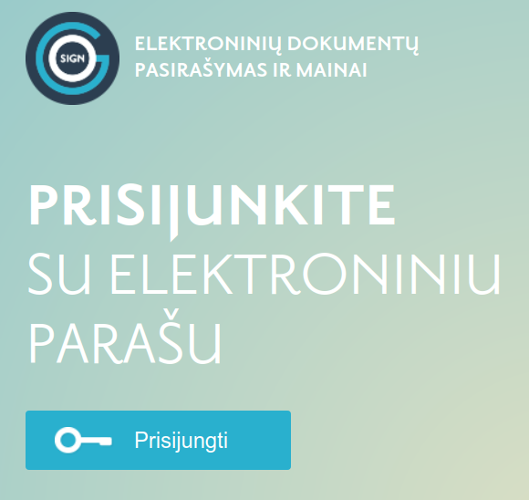
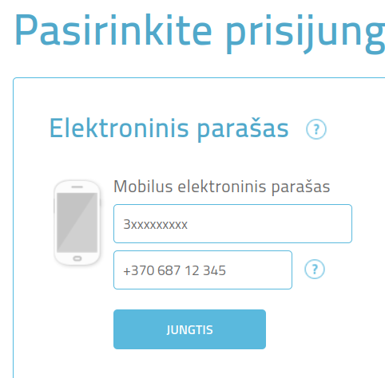
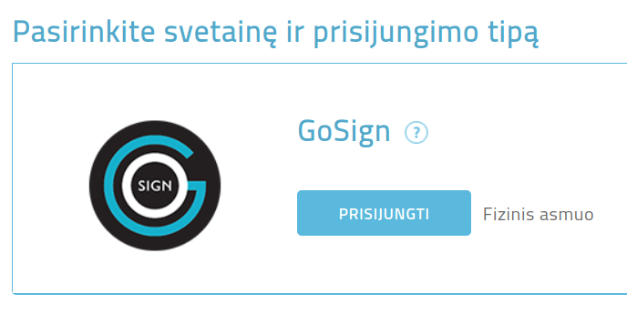
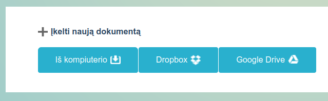
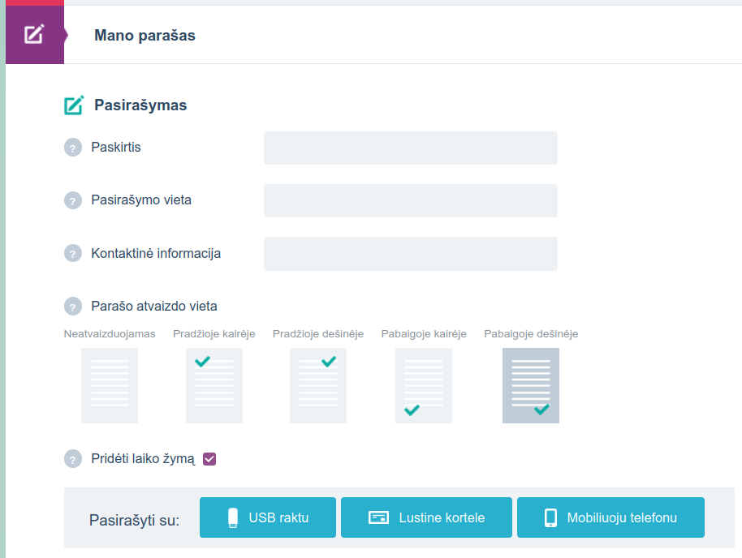
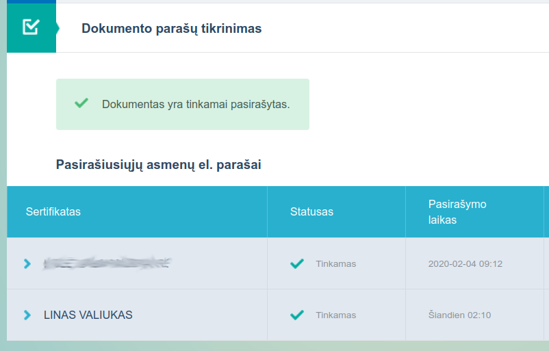
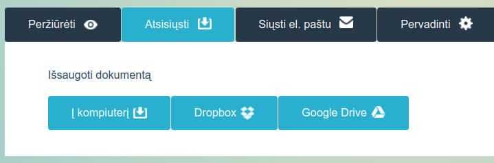

# Peticijos pasirašymo su "GoSign" instrukcija

Turint mobilųjį elektroninį parašą, itin paprasta dokumentus pasirašyti su "GoSign".

1. Atsisiųskite failą [`covid-peticija.pdf`](covid-peticija.pdf) su mano parašu.
2. Perskaitykite peticijos tekstą, jeigu dar neperskaitėte.
3. Eikite į <https://www.gosign.lt/lt/>
4. Spauskite "Prisijungti":

    

5. Prisijunkite su mobiliuoju elektroniniu parašu:

    

6. Prisijunkite kaip fizinis asmuo:

    

7. Atsidariusiame dokumentų sąraše pavažiuokite truputį žemyn, blokelyje "Įkelti naują dokumentą" spauskite "Iš kompiuterio" ir pasirinkite anksčiau atsisiųstą `covid-peticija.pdf`:

    

8. Išplėskite skiltį "Mano parašas", nieko nekeiskite (jeigu norite, nustatykite "Parašo atvaizdo vietą" į "Pabaigoje dešinėje") ir spauskite "Pasirašyti su: Mobiliuoju telefonu":

    

9. *(nebūtinai)* Išplėskite skiltį "Dokumento parašų tikrinimas" ir patikrinkite, ar abu parašai galioja:

    

10. Apačioje paspauskite ant mygtuko "Atsisiųsti" ir išsaugokite dokumentą "Į kompiuterį":

    

11. Atsisiųstą dokumentą su **abiem parašais** (nesumaišykite su tuo, kuris tik su mano parašu) atsiųskite el. paštu <peticija@antismaukykla.com>.
