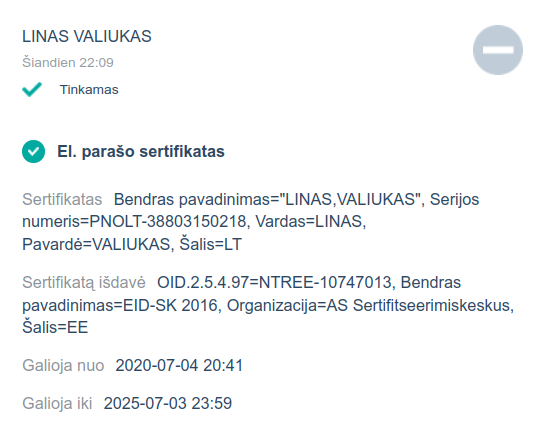

# Uždarykime smaukyklą COVID-19 skiepijime!

## Dabartinis smaukyklos statusas

Šiuo metu (2021 m. kovo 5 d.) smaukykla COVID-19 skiepijime vis dar yra **atidaryta**.

## Aprašymas

Stebint pastarųjų dienų skiepijimo nuo COVID-19 situaciją Lietuvoje, akivaizdu, kad yra plačiai atidaryta erdvi respublikinė **smaukykla** (angl. *circlejerk*):

* Kanclerė [neina lengviausiu keliu, bet pažeidžiamiausieji neina skiepytis](https://www.15min.lt/naujiena/aktualu/lietuva/sam-kanclere-stengiames-nenueiti-lengviausiu-keliu-ir-pirma-skiepijame-pazeidziamiausius-56-1466252);
* Metus sėdint prie teliko neužteko laiko apsišviesti dėl vakcinų poveikio, [reikia dar vienos švietimo kampanijos](https://www.lrt.lt/naujienos/lietuvoje/2/1356241/profesorius-perspeja-del-kylanciu-gresmiu-turime-kuo-greiciau-pradeti-svietimo-kampanija-kad-neutralizuotume-pandemiju-neigejus);
* Skiepijimo centrai [turi per daug vakcinų ir per mažai norinčių iš tikslinės amžiaus grupės](https://www.lrt.lt/naujienos/sveikata/682/1357802/skiepijimo-centrams-nespejant-panaudoti-vakcinu-zadama-aktyviau-vakcinuoti-ir-savaitgaliais);
* Šalčininkuose [persižiūrėjo "Первый Балтийский" ir vakcinuosis tik Sputniku ir tik pas Batką](https://www.lrt.lt/naujienos/lietuvoje/2/1358744/nuo-covid-19-skuba-skiepytis-ne-visi-dalis-salcininku-gyventoju-laukia-sputnik-v-vakcinos-del-jos-vaziuotu-ir-i-baltarusija);
* Kiti į vakcinaciją [tiesiog neateina](https://www.lrt.lt/naujienos/sveikata/682/1355361/kol-vakcinacija-nuo-covid-19-isibegeja-klaipedoje-issukiu-kelia-nepasirodantys-asmenys-ir-popierizmas).

## PASIRAŠYTI PETICIJĄ

Peticiją iki **FIXME** datos prašau **pasirašyti sertifikuotu elektroniniu parašu** ir **atsiųsti man**:

1. Atsisiųskite mano pasirašytą bylą **[`covid-peticija.pdf`](covid-peticija.pdf)**;
2. **Perskaitykite** peticiją ir įsitikinkite, kad sutinkate su joje išdėstytais prašymais;
3. **Pasirašykite** bylą su "GoSign", "Dokobit" (žr. instrukcijas apačioje) ar kita pasirašymo priemone;
4. Atsiųskite **mano ir jūsų kartu** pasirašytą bylą man el. pašto adresu **[mailto:linas.valiukas@gmail.com?subject=Smaukykla]**; el. laiško temoje būtinai įrašykite raktažodį "**Smaukykla**".

### "GoSign" instrukcija

FIXME

### "Dokobit" instrukcija

FIXME

## Klausimai - atsakymai

### Ar nori atimti iš babytės skiepą?

Ne - babytė kaip turėjo galimybę pasiskiepyti prieš mane, jaunuolį, taip ir turės toliau. Noriu papildomai motyvuoti babytę nueiti pasiskiepyti, kad babytės pagaliau taptų suskiepytos, o tada mano tėvai, ir gal kažkada jau ir aš.

Būtų idealu, jeigu visos Lietuvos babytės, paskatintos už jų laukiančios gyvos eilės, čiuptų savo ridikiulius ir suskubtų į poliklinikas.

### Ar čia Latvių gatvės psy-opsas?

Ne.

### O tai negalim ten paprastai per kokį peticijos.lt pasirašyti?

Daug kas esam "pasirašinėję" peticiją viename iš tam skirtų tinklalapių - už / prieš šuniukus, gėjus, 420, 69, vaiko pinigus, musulmonus, transvestitus, "Maximą" ir kt. Deja, visi tiesiog veltui sugaišome laiką - tos peticijos buvo niekinės, nes nebuvo pasirašytos nei tušinuku, nei elektroniniu parašu.

Dabartinė Peticijų įstatymo redakcija [leidžia](https://e-seimas.lrs.lt/portal/legalAct/lt/TAD/TAIS.84574?jfwid=5sjolfznc) pasirašyti peticiją ir elektroniniu būdu, bet nėra nė vieno tinklapio, kuris leistų tai padaryti. Man atrodo, žinau kodėl - elektroninis parašas kainuoja [pinigus](https://www.dokobit.com/lt/kainos), taigi privačios įmonės nenori mokėti už jūsų peticijos parašus, o viešasis sektorius išvis ne itin suinteresuotas, kad jūs kažką ten pasirašinėtumėt, siųstumėt ir jiems tuomet reikėtų tai svarstyti.

Aš pinigų, skirtų sumokėti už kiekvieno iš pasirašančiųjų elektroninį parašą ant vieno ir to paties dokumento, irgi neturiu, taigi siūlau peticiją pasirašyti šitaip:

1. Ant parengto peticijos teksto visų pirma pasirašau aš; tai apsaugos nuo to, kad peticijos tekstas vėliau būtų pakeistas;
2. Dokumentą su savo pasirašytu peticijos tekstu atsisiųskite ir pasirašykite jį patys; ant dokumento tuomet atguls du parašai - mano ir jūsų;
3. Savo pasirašytą peticiją atsiųskite man;
4. Surinkęs visus pasirašytus dokumentus nurodytą datą juos nusiųsiu į Sveikatos apsaugos ministeriją.

### Bet tai jeigu savo laiške SAM rašysi žodį "smaukykla", tai gali nelabai rimtai į tave pažiūrėti

Na tai gal tada žodžio "smaukykla" nerašysiu.

### Ar rimtai nepanaudotą vakciną išmeta?

Nežinau - jūs man pasakykit. Man atrodo, kad skiepyjantys apie tai nenori šnekėti, o spaudos atstovai prisibijo klausti. Vasario 26 d. publikuotame straipsnyje teigiama, kad [80% "AstraZeneca" vakcinos dozių nepanaudota](https://www.15min.lt/naujiena/aktualu/pasaulis/tyrimas-80-proc-i-es-atgabentu-astrazeneca-vakcinos-doziu-dar-nepanaudota-57-1462530); na, ji bent jau [galioja šešis mėnesius](https://assets.publishing.service.gov.uk/government/uploads/system/uploads/attachment_data/file/963838/AZD1222_Information_for_Healthcare_Professionals_-_22-02-2021.pdf) ir ją nesudėtinga laikyti, bet štai koks "Pfizer", išimtas iš šaldytuvo, turi būti suleistas [per penkias dienas](https://www.hse.ie/eng/health/immunisation/hcpinfo/covid19vaccineinfo4hps/pres5.pdf).

### Kaip atšaukti savo parašą?

Jokių problemų - parašykite <FIXME@FIXME.lt>. Vis dėlto, turėkite omenyje, kad FIXME dieną peticiją siųsiu Sveikatos apsaugos ministerijai, tad jeigu norėsite atšaukti savo parašą po šios datos, turėsite kreiptis tiesiai ten.

### Kas tu toks?

Aš esu Linas Valiukas, vilnietis, žurnalistas pagal išsilavinimą ir programuotojas pagal profesiją. Esu už vakcinas ir prieš smaukyklas. Su manimi galite susisiekti [el. paštu](mailto:linas.valiukas@gmail.com)

## Privatumas

Jeigu nuspręsite pasirašyti mano paruoštą peticiją ir ją atsiųsti man, aš gausiu dokumentą, kuriame bus įrašytas jūsų vardas, pavardė, el. pašto adresas (ne visada) ir asmens kodas. Tai yra standartinė informacija, kuri įrašoma į visus sertifikuotu elektroniniu parašu pasirašomus dokumentus.

Kadangi jūsų pasirašytą dokumentą pirmasis pasirašiau aš, dokumento paraše galite rasti ir mano vardą, pavardę bei asmens kodą, todėl (**pajuokaujant!**) jeigu aš, naudodamasis šiais duomenimis apie jus, sugebėsiu paimti greitąjį kreditą ant jūsų, tai jūs tada galėsite paimti greitąjį kreditą atgal ant manęs :)

Štai kaip atrodo tie asmens duomenys:

Juokai juokais, bet jūsų asmens duomenų **nenaudosiu niekur kitur** išskyrus aukščiau aprašytos peticijos pateikimą Sveikatos apsaugos ministerijai. Duomenų neperduosiu šalims, nesusijusiomis su peticijos pateikimu, nepadovanosiu, neparduosiu, nerodysiu draugeliams, neskaitysiu pavardžių ir nežvengsiu, žodžiu, nepadarysiu su jais CityBee.

Įsitikinęs, kad peticija priimta ir daugiau surinktų duomenų (pasirašytų peticijos kopijų) nebereikės, ištrinsiu visas turimas peticijos kopijas, o tuo pačiu ir jūsų asmens duomenis.
